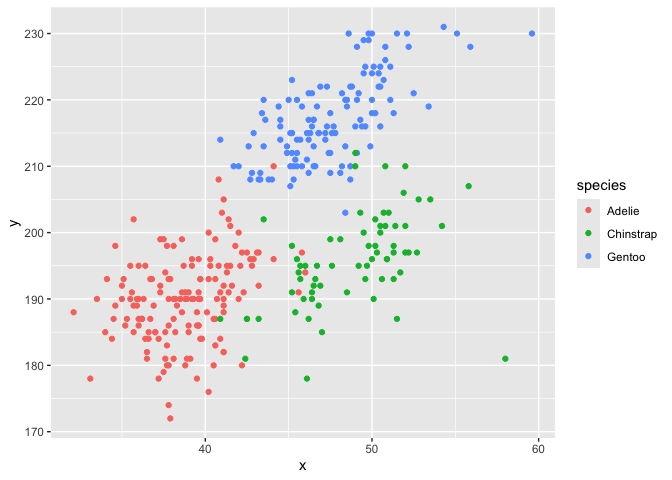

p8105_HW1
================
Leyang Rui
2024-09-14

## P8105 HW1

### Problem 1

``` r
### Import dataset
data("penguins", package = "palmerpenguins")
```

Description:  
There are 8 variables in total in this dataset.  
- species: Qualitative with 3 levels: Adelie, Chinstrap, Gentoo; the
specific species of the penguin.  
- island: Qualitative with 3 levels: Biscoe, Dream, Torgersen; the
island the penguin lives.  
- bill_length_mm: Quantitative, length of the penguin’s bill in mm.  
- bill_depth_mm: Quantitative, depth of the penguin’s bill in mm.  
- flipper_length_mm: Quantitative, length of the penguin’s flipper in
mm.  
- body_mass_g: Quantitative, weight of the penguin in gram.  
- sex: Qualitative with 2 levels: male, female; sex of the penguin.  
- year: Quantitative ordinal variable.

Size of the dataset: There are 8 columns and 344 rows in this dataset.

Mean flipper length: The mean flipper length of the penguins is
200.9152047 mm.

``` r
### Scatterplot
species = penguins %>% pull(species)
plot_df =
  tibble(
    x = penguins %>% pull(bill_length_mm),
    y = penguins %>% pull(flipper_length_mm)
  )
bill_flipper_scatter = ggplot(plot_df, aes(x = x, y = y, color = species)) +
  geom_point()
bill_flipper_scatter
```

<!-- -->

``` r
### export plot
ggsave("bill_flipper_scatter.png", plot = bill_flipper_scatter)
```

### Problem 2

``` r
### create dataframe
prob2_df = 
  tibble(
    rand_x = rnorm(10),
    vec_logic = rand_x > 0,
    vec_char = c("a", "b", "c", "d", "e", "f", "g", "h", "i", "j"),
    vec_fac = factor(c("august", "august", "august", "setp", "setp", "setp", "setp", "oct", "oct", "oct"))
  )
### compute mean
mean_x = mean(prob2_df %>% pull(rand_x))
mean_logic = mean(prob2_df %>% pull(vec_logic))
mean_char = mean(prob2_df %>% pull(vec_char))
mean_fac = mean(prob2_df %>% pull(vec_fac))
mean_x
```

    ## [1] -0.1329835

``` r
mean_logic
```

    ## [1] 0.5

``` r
mean_char
```

    ## [1] NA

``` r
mean_fac
```

    ## [1] NA

As the code output shows, the means for the random sample of normal
distribution and the logical vector work, but the means for the
character vector and the factor vector do not.

``` r
### convert variables
as.numeric(prob2_df %>% pull(vec_logic))
as.numeric(prob2_df %>% pull(vec_char))
as.numeric(prob2_df %>% pull(vec_fac))
```

As the code output shows, the as.numeric function can successfully turn
the logical and the factor variables into numbers, but not the character
variable, which it returns NAs. Moreover, for the factor variable, the
numbers the function returns are actually the number codes of the
factor’s levels. So the as.numeric function also cannot turn the factor
variable into computable numbers. This explains why we cannot take the
means for neither the character nor the factor variables.
